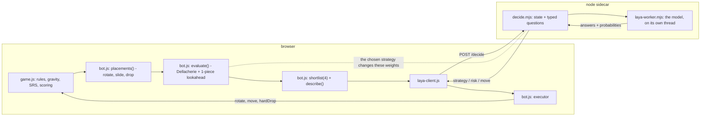
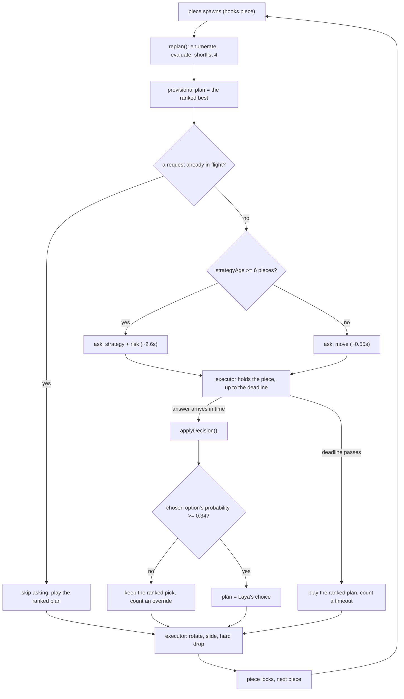
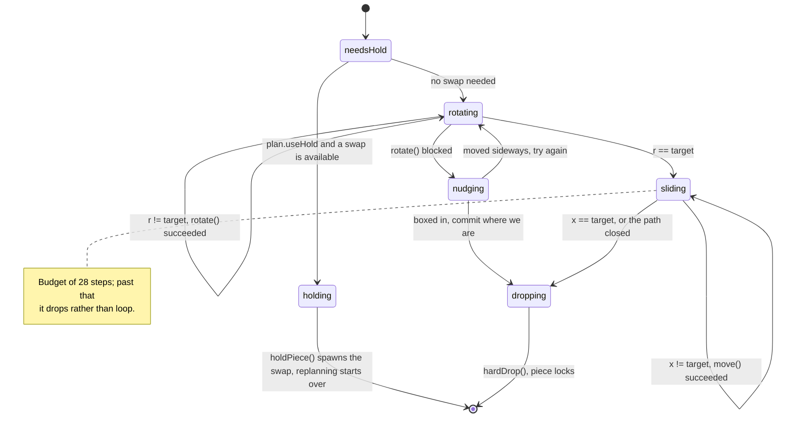
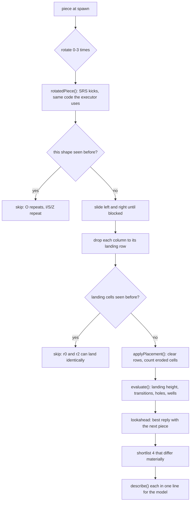
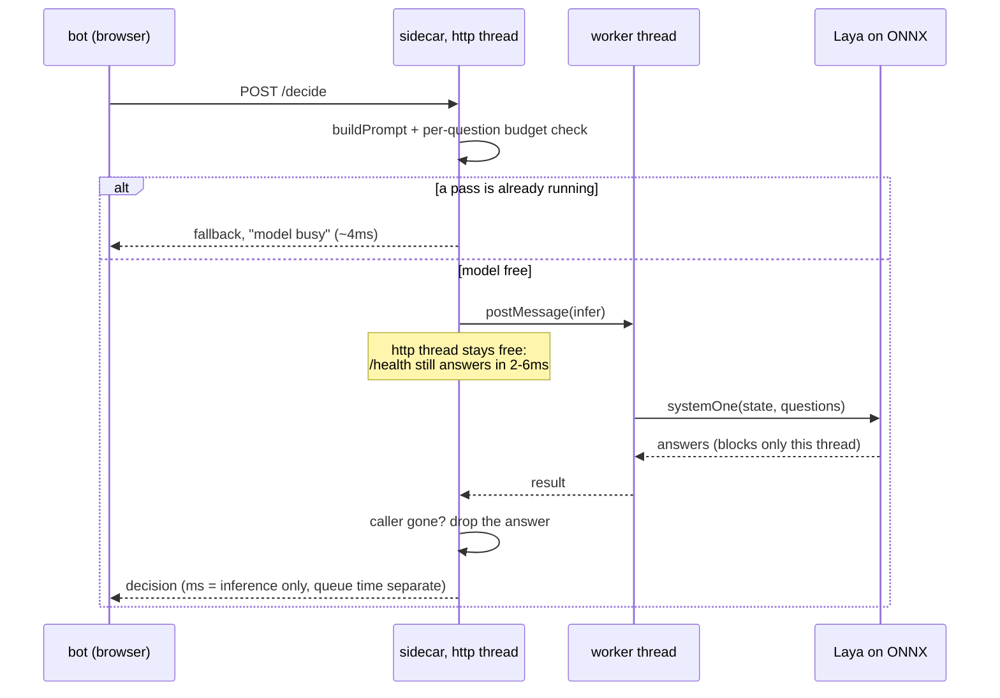
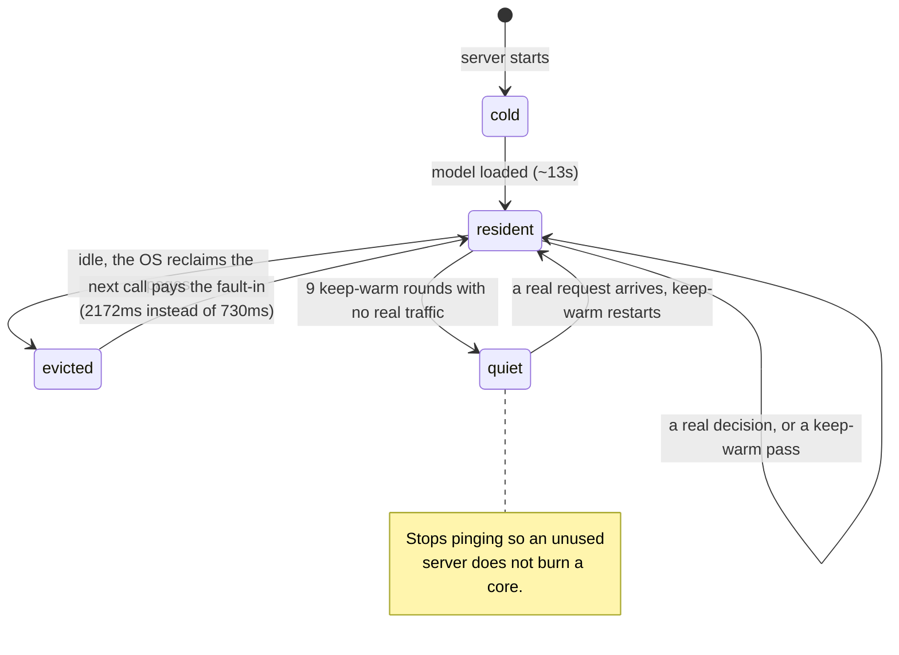
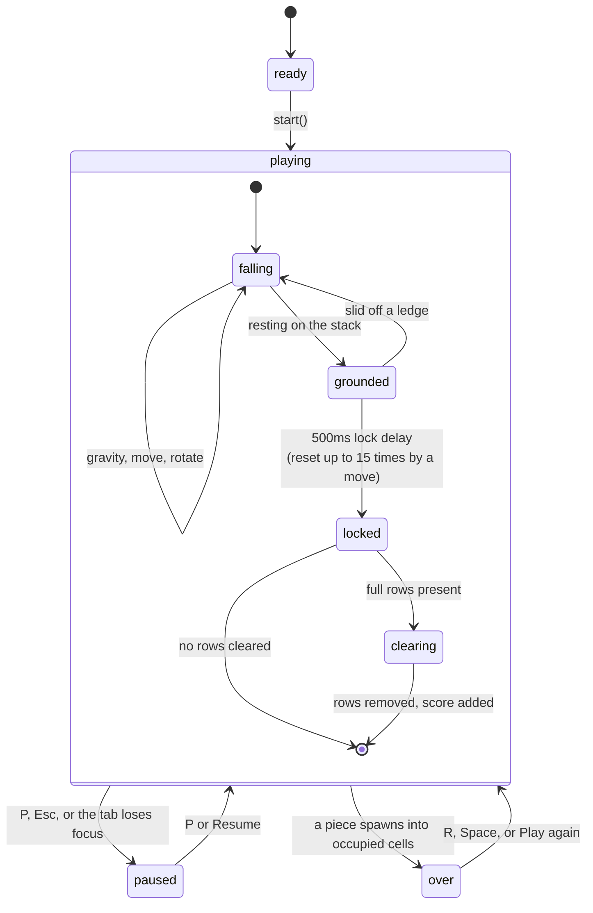

# Tetris with a Laya decision engine

A single-player Tetris that can also be played *by* a decision engine built on
**[Laya](https://huggingface.co/convaiinnovations/laya)**, the open-source System 1
decision model from Convai Innovations.

```
npm test                                   # 297 assertions, no model needed
node server/server.mjs                     # game on :8787 (engine: fallback)
cd server && npm install                   # ~290 MB of onnxruntime binaries
LAYA=1 LAYA_REVISION=<sha> node server/server.mjs   # the real model (1.69 GB of weights)
```

**Verified on the real checkpoint.** `tests/real-model-test.js` loads the actual 1.69 GB
bundle and plays real Tetris through it - 35 assertions, all passing:

```
laya decided 12 of 14 pieces   fallback=0  offline=0  timeouts=0  skipped=0
moves chosen  {c:4, b:4, d:2}  - not once the heuristic's own top pick "a"
gating fired  6 overrides on answers below the 0.34 floor
inference     min 555ms  avg 746ms  max 1417ms
move call     244 tokens -> {a:0.296, b:0.158, c:0.260, d:0.285}
style call    build_tetris p=0.771 over all five styles
```

It skips itself unless the bundle is cached, so `npm test` never starts a download.

`index.html` also opens straight off disk (`open index.html`) and plays perfectly well
as an ordinary game — the engine panel simply reports `offline`.

---

## What Laya actually is, and what it can't do

Laya is **not** a chat model and does not generate text. It is a *non-autoregressive*
"System 1" decision model: a ModernBERT-large bidirectional encoder (421M parameters)
with a 2-layer decision head that scores options at `[MASK]` markers. You give it a
**state** (any set of text fields) and **typed questions**, and it answers all of them
in a single forward pass with *calibrated* probabilities — about 33 ms on a T4, ~140 ms
on an Apple-silicon CPU. Three question types:

| type | answer |
|---|---|
| `choice` | one option, plus a probability for every option |
| `score` | an expected level on an ordered rubric, plus the distribution |
| `noul` | a calibrated P(true) for a yes/no statement |

Two consequences shaped this whole design:

1. **It cannot search or reason spatially.** It has no idea what a Tetris board is.
   Asking it "which column should this S-piece go in?" from a picture of the well would
   be asking a text classifier to do tree search. So it is not asked that.
2. **It cannot run in the browser.** The weights are ~1.7 GB and it runs on ONNX Runtime
   under Node (`@receptron/laya`, Node 20+, ~2 GB RAM). Hence the sidecar in `server/`.

Laya's context window is **512 tokens** on the English checkpoint, which is a hard
constraint on the prompt — see *Prompt budget* below.

## The division of labour

The engine is deliberately split at the line Laya's strengths fall on:



### What happens on every piece



The executor is deliberately a state machine recomputed each tick rather than a recorded
script, because gravity and rotation kicks move the piece underneath it:



A late answer is not wasted: a play style is not piece-specific, so if it arrives after
the piece locked it is still adopted for the next one. Only a stale *move* is discarded.

**The deterministic half** (`bot.js`) does what a heuristic is good at: it enumerates
every placement reachable by *rotate at the top, slide, drop* — the same moves a player
has — and scores the resulting board with Dellacherie's evaluation function (landing
height, eroded piece cells, row/column transitions, holes, cumulative wells), plus a
one-piece lookahead. A test drives 220 random positions and asserts that every
placement the planner proposes lands **exactly** where it said it would.



**Laya's half** is the judgement:

| question | type | what it changes |
|---|---|---|
| `strategy` | `choice` of 5 | which weight profile ranks the placements |
| `risk` | `score` 0–3 | how close to topping out (shown, and useful context) |
| `move` | `choice` of 4 | **the placement that actually gets played** |

The five strategies are real distortions of the evaluation, not labels:

- `balanced` — Dellacherie as published.
- `downstack` — doubles the hole penalty; digs buried cells out.
- `build_tetris` — pays to keep the last column empty and **penalises single clears**
  (`lineScore[1] = -55`) so it stacks nine wide for a four-row clear.
- `flatten` — weights surface roughness and peak height.
- `survive` — heavily weights height and pays big for any clear.

A test asserts `build_tetris` is the only profile that turns down a cheap single clear,
and that all five still cash a tetris.

## One decision per piece

When a piece spawns, `bot.js` ranks the placements, takes the best four *materially
different* ones and describes each in one line. Those lines are the options Laya chooses
between, so the choice is over concrete consequences:

```
strategy  choice   balanced | downstack | build_tetris | flatten | survive
risk      score    plenty of room / getting tall / dangerous / about to top out
move      choice
  a  "I turned right in col 10, clears 4 rows, buries none, peak 0/20, flatter."
  b  "I flat in cols 1-4, clears nothing, buries none, peak 5/20, right column open."
  c  "T flipped in cols 8-10, clears nothing, buries 1, peak 6/20, rougher."
  d  "L turned left in col 1, clears nothing, buries none, peak 5/20, needs the hold swap."
```

`POST /prompt` with the same body as `/decide` returns the exact state and questions the
model would be asked, plus the token estimate — useful for seeing what it is reading.

### Running the model without freezing the server

`onnxruntime-node` blocks the thread it runs on for the whole forward pass.
Measured here: with the model on the main thread, `/health` went from **2ms** to
**4505ms** during a decision - every probe unblocking at the instant the pass finished.
The server was not slow, it was *frozen* for 2-4s per decision, and could not accept a
connection, answer a health check, or notice that a caller had given up.

So the model runs on a **worker thread** (`server/laya-worker.mjs`). With the HTTP thread
free, the things below actually work - before it, queue depth read `0` while the server
was badly backed up, because requests could not even be parsed:

| | main thread | worker thread |
|---|---|---|
| `/health` during a pass | 4505ms | **2-6ms** |
| a move decision | 2000-4000ms | **~700ms** |
| four parallel requests | all queue, last ~13s | 1 served, 3 shed in 4ms |

Inference got faster too: the HTTP thread was competing with ONNX for CPU.



Three more things keep it honest under load:

- **Load shedding.** One request may hold the model; a second gets an immediate
  deterministic answer (`"model busy"`) rather than joining a queue whose answers would
  arrive too late to use. The badge flips to `fallback`, which is true.
- **Abandoned work is dropped.** If the caller has gone away while a request waited, the
  pass is skipped instead of holding the model for nobody. The transport timeout is a
  20s safety net - at 2.5s it used to abort every play-style call mid-flight while the
  server carried on computing, which is what made the backlog cascade.


- **Keep-warm.** 1.69 GB of weights get evicted when idle: a call after 60s of silence
  took 2172ms against 730ms warm. A tiny pass every 20s holds them resident (882ms after
  the same idle), and it stops itself after a few quiet rounds so an unused server does
  not burn a core.

`/health` reports `avgMs` (inference only), `avgWaitMs` (arrival to pass start), `queued`,
`shed`, `abandoned` and `warmups`, so a saturated or cold model is visible rather than
looking like a game that quietly stalled.

### Guardrails

- **Confidence gating.** Laya's own docs recommend thresholding. If the chosen option's
  probability is below `confidenceFloor` (0.34), the deterministic top pick is played
  instead and the UI counts an *override*. Note the gate uses the chosen option's
  probability, not Laya's `confidence` field, which is an entropy measure over the whole
  distribution.
- **A deadline.** The executor waits for the answer for at most 60% of the current
  gravity interval (120–600 ms). Past that it plays the ranked pick and counts a
  *timeout*. A slow model never costs you the piece.
- **Degradation, labelled.** Model missing → the sidecar answers with deterministic rules
  and reports `engine: "fallback"`. Sidecar missing → the client returns null and the bot
  uses its own ranking, reporting `offline`. The badge never says `laya` unless Laya
  actually answered.
- **The hold swap is not a separate question.** Placements that need it are among the
  move options and say so, so there is no second answer to contradict the first.

### Prompt budget

The move options are last in the prompt, so silent truncation would eat exactly the part
the decision depends on. `buildPrompt()` estimates tokens and trims in order — shorten
the ascii well, drop it, drop the rules blurb, then shorten the option text — targeting
440 tokens against the 512 window. A normal mid-game prompt comes in around 365 and
trims nothing; a test asserts a worst case still fits and that the move options survive.

## What touches the network

Everything runs on this machine. Specifically:

| thing | network |
|---|---|
| the page (`index.html` + 3 scripts) | none — no CDN, no web fonts, no analytics. The only URL in the source is `http://localhost:8787` |
| the sidecar | binds **127.0.0.1 only** by default, so nothing outside this machine can reach it. `HOST=0.0.0.0` opts into exposing it and prints a warning, because `/decide` has no authentication |
| board state | posted to the loopback sidecar and nowhere else |
| Laya inference | fully local, in-process, on ONNX Runtime. `@receptron/laya`'s inference path makes no network calls of any kind |
| Laya weights | downloaded **once** from `huggingface.co/receptron/laya-onnx` into `~/.cache/receptron-laya` (override with `LAYA_CACHE`) |
| later startups | the loader makes a `HEAD` request per bundle file (5 total) to compare byte counts. If it fails — offline, DNS, 5xx — the cached copy is used anyway, so it works with no network. Pass `LAYA_MODEL_DIR=/path/to/bundle` to skip the check entirely and never touch Hugging Face |

So the only outbound traffic in the whole system is fetching the model weights once, plus
5 HEAD requests at each startup unless `LAYA_MODEL_DIR` is set. Nothing about your play,
your board, or your machine is sent anywhere.

## The game itself

Independent of the engine, `game.js` is an ordinary Tetris with its own states - the bot
drives exactly the same primitives a keypress does, so there is no separate path through
the rules:



## Playing it

| mode | what happens |
|---|---|
| **Off** | plain Tetris, no engine, no network |
| **Assist** | you play; the recommended placement is outlined on the board and the panel shows the reasoning |
| **Autoplay** | the engine plays; `Watch` / `Fast` / `Instant` set the pace |

Keys: arrows move, `↓` soft drop, `Space` hard drop, `↑`/`X` rotate, `Z` rotate CCW,
`C` hold, `P` pause, `R` restart, `M` cycles engine mode. Touch and swipe work too.

The panel shows the chosen strategy with its probability, the risk meter, all four
candidates with Laya's distribution over them, latency, and a running tally of
laya / fallback / offline / override / timeout counts.

## Files

| file | what it is |
|---|---|
| `index.html` | markup, styling, and the glue that wires the three modules together |
| `game.js` | the game: board, SRS rotation with wall kicks, 7-bag, lock delay, scoring. Exposes `window.Tetris` |
| `bot.js` | placement enumeration, feature evaluation, strategy profiles, shortlist, executor. Runs in Node too |
| `laya-client.js` | browser → sidecar; every failure resolves to null |
| `server/server.mjs` | static files, `/health`, `/decide`, `/prompt`; loads Laya lazily |
| `server/decide.mjs` | board → Laya state + questions → decision. Pure, and the fallback rules |
| `tests/*-test.js` | `logic` (game rules), `bot` (search, evaluation, executor), `decide` (prompt, parsing, HTTP), `ui` (the page glue against the markup), `e2e` (all of it against a live sidecar) |

## How well does it actually play?

Worse than the search alone, and that is the expected result. In the verified run Laya
cleared **0 lines in 14 pieces**; the deterministic ranking on its own clears about one
line every 3.3 pieces and survives indefinitely. Laya is a general text classifier with
no Tetris training, choosing between four one-line descriptions - its strategy picks look
sensible (`build_tetris` at p=0.77 on a clean low board) while its move choices sit much
closer to a coin flip.

The same model routes support tickets at 0.93 confidence. The gap is the point: this is a
real decision engine with calibrated, inspectable probabilities and working confidence
gating, not a better Tetris player.

## Limitations, honestly

- **The deterministic ranking is the stronger player.** Laya is choosing among four
  already-good placements, which bounds how much harm — or good — its choice can do.
  With the fallback engine the bot clears ~215 rows per 700 pieces and does not top out.
- **Laya has no Tetris training.** It is reading a plain-English description of four
  options and picking one. It is a genuine decision, but a general one, not expertise.
- **The English checkpoint is not multilingual** here; `subfolder: "multilingual"` in
  `Laya.load()` would switch to the 322M mmBERT variant with a 1024-token window.
- **Tucks and spins are not searched.** Placements are rotate-slide-drop only, so some
  legal overhang placements are never considered.
- **No rendering test.** The suites stub the canvas, so the drawing calls run but the
  layout and the look of the board are the one thing not verified.
- **Laya is slower than a game loop.** A move decision takes ~0.55s, so at "Instant"
  speed the game outruns it. Tick **Wait for every decision** to hold each piece until the
  model answers - slower, but every placement is then genuinely Laya's. Without it the bot
  plays its ranked pick whenever the deadline passes, and the tally shows how often.
